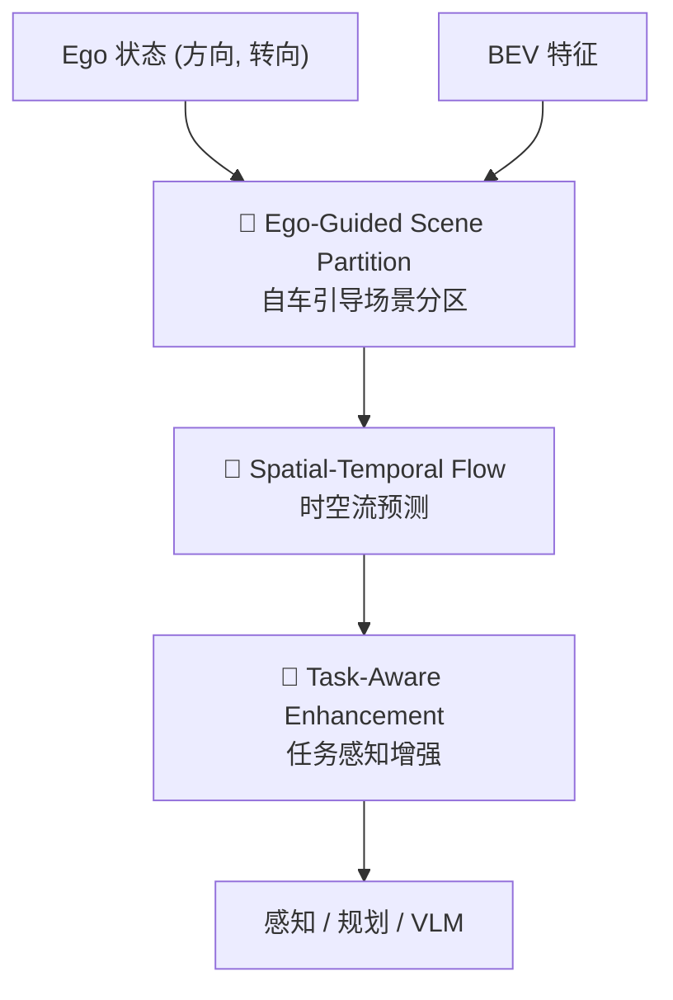
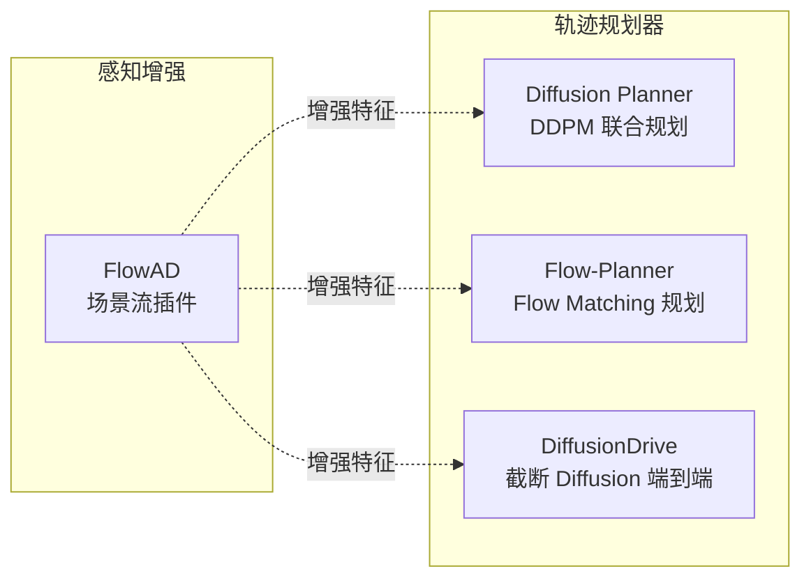
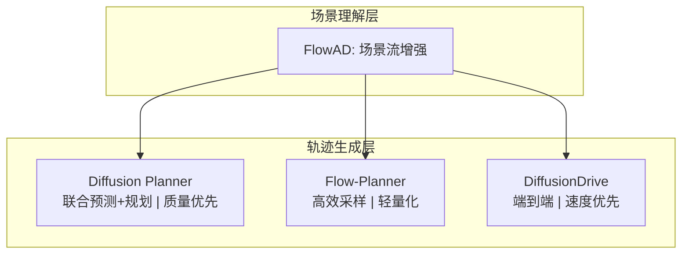

# FlowAD 深入解读 & 四篇论文对比分析

## 一、论文全景

| | FlowAD | Flow-Planner | Diffusion Planner | DiffusionDrive |
|---|--------|-------------|-------------------|----------------|
| **发表** | ICLR 2026 | NeurIPS 2025 | ICLR 2025 (Oral) | CVPR 2025 (Highlight) |
| **单位** | 上交 + 百度 | — | — | — |
| **核心** | 场景流增强 | Flow Matching 规划 | Diffusion 联合预测+规划 | 截断 Diffusion 端到端 |

---

## 二、FlowAD 深入解读

### 2.1 问题动机

传统 AD 环境建模是**单向的**：感知场景 → 规划行为。忽略了：

> **自车的运动会改变观测到的场景**。转弯时，场景相对于你的"流动"方式完全不同。

FlowAD 建模这种"ego-scene 交互"——自车运动对场景感知的反馈。

### 2.2 核心方法：三大模块



| 模块 | 作用 |
|------|------|
| **Ego-Guided Partition** | 以 ego 前进方向 + 转向速度，将 BEV 空间分为自适应 "flow units" |
| **Spatial-Temporal Flow** | 预测每个 flow unit 的空间位移 + 时间演变 |
| **Task-Aware Enhancement** | Object-level + Region-level 策略增强下游任务 |

### 2.3 FCP 指标

**Frames before Correct Planning** = 碰撞发生前多少帧模型已规划出正确避障轨迹。

FCP 越大 → 模型越早"预见"危险 → 场景理解越强。

### 2.4 实验结果

- nuScenes 碰撞率比 SparseDrive 降低 **19%**，FCP 提升 **1.39 帧**
- Bench2Drive driving score **51.77**

---

## 三、四篇论文全面对比

### 3.1 方法定位对比



> [!IMPORTANT]
> FlowAD 是**插件式增强模块**，不直接生成轨迹；其余三者是**轨迹规划器**，直接输出 ego 轨迹。

### 3.2 核心维度对比表

| 维度 | FlowAD | Diffusion Planner | Flow-Planner | DiffusionDrive |
|------|--------|--------------------|-------------|----------------|
| **角色** | 特征增强插件 | 轨迹规划器 | 轨迹规划器 | 端到端驾驶 |
| **"Flow/Diffusion" 含义** | 物理场景流 | DDPM 去噪扩散 | Flow Matching (CondOT) | 截断扩散 |
| **能否独立工作** | ❌ 需搭配 planner | ✅ | ✅ | ✅ |
| **输入** | 多视角图像/BEV | 向量化场景 | 向量化 .npz | 多视角图像 |
| **轨迹输出** | 无(增强特征) | ego + 邻居轨迹 | ego 轨迹 | ego 轨迹 |
| **联合预测** | — | ✅ 联合预测+规划 | ❌ 仅规划 | ❌ 仅规划 |
| **多模态控制** | — | Classifier Guidance | Classifier-Free Guidance | 多模态锚点 |
| **采样步数** | — | ~20 步 | ~4-10 步 ODE | **2 步** |
| **评估基准** | nuScenes, Bench2Drive | **nuPlan** | **nuPlan** | NAVSIM, nuScenes |

### 3.3 生成范式演进

三种规划器代表了生成模型在 AD 中的演进路线：

````carousel
#### Diffusion Planner — DDPM 扩散

```
x_T ~ N(0,1) → 逐步去噪 (T=20步) → x_0 (轨迹)
```

- 标准 DDPM/DDIM 去噪流程
- **联合建模** ego + 邻居轨迹（独特优势）
- **Classifier Guidance**：训练额外分类器，推理时用梯度引导安全/舒适
- DiT (Diffusion Transformer) 架构
- 缺点：步数多，推理偏慢（~20Hz）

<!-- slide -->

#### Flow-Planner — Flow Matching

```
x_0 ~ N(0,1) → ODE 积分 (4-10步) → x_1 (轨迹)
x_t = t·x₁ + (1-t)·x₀  (CondOT 直线路径)
```

- 用最优传输路径代替扩散的随机路径
- **更短路径 → 更少ODE步数 → 更快采样**
- **CFG (Classifier-Free Guidance)**：训练时随机 drop 条件，推理时无需额外分类器
- 轨迹 tokenization 降低建模复杂度
- 相比 Diffusion Planner：更高效，但不做邻居联合预测

<!-- slide -->

#### DiffusionDrive — 截断扩散

```
多模态锚点 x_anchor → 仅 2 步去噪 → x_0 (轨迹)
```

- **核心创新**：不从纯噪声开始，从预设的多模态锚点轨迹开始
- 大幅截断扩散过程：20步 → **2步**
- 端到端：直接从图像到轨迹
- **45 FPS**（4090 GPU），最快的方案
- NAVSIM 上 88.1 PDMS (SOTA)
````

### 3.4 算力需求对比

| | FlowAD | Diffusion Planner | Flow-Planner | DiffusionDrive |
|---|--------|-------------------|-------------|----------------|
| **需要图像处理** | ✅ BEV backbone | ❌ 向量输入 | ❌ 向量输入 | ✅ 图像 backbone |
| **Scene Flow 计算** | ✅ 额外开销 | ❌ | ❌ | ❌ |
| **典型训练 GPU** | 8×A100 | 4-8×A100 | **单卡 2060 可跑** ✅ | 8×A100 |
| **推理速度** | 取决于下游 | ~20 Hz | 可调 (步数) | **45 FPS** |
| **训练数据规模** | ~TB (原始图像) | ~GB (向量) | ~GB (向量) | ~TB (原始图像) |

> [!TIP]
> **算力友好度排序**: Flow-Planner >> Diffusion Planner > DiffusionDrive ≈ FlowAD
>
> Flow-Planner 和 Diffusion Planner 使用预处理后的向量化数据，跳过了最耗算力的图像感知部分。

### 3.5 关键设计决策对比

| 设计选择 | Diffusion Planner | Flow-Planner | DiffusionDrive |
|---------|-------------------|-------------|----------------|
| **联合预测邻居** | ✅ 同时预测 ego + 邻居 | ❌ 仅 ego | ❌ 仅 ego |
| **推理可控性** | Classifier Guidance (需训练分类器) | CFG (无需额外模型) | 锚点选择 |
| **数据增强** | 标准增强 | Ego 状态扰动 + 轨迹重插值 | — |
| **Consistency Loss** | ❌ | ✅ 重叠 token 一致性 | ❌ |
| **与 FlowAD 兼容** | ✅ 可用增强特征 | ⚠️ 需适配 | ✅ 可用增强特征 |

---

## 四、总结与启示

### 四篇论文的互补关系



### 选择建议

| 场景 | 推荐 |
|------|------|
| **算力有限（单卡消费级）** | Flow-Planner ✅ |
| **需要联合预测邻居** | Diffusion Planner |
| **追求实时部署** | DiffusionDrive (2步, 45FPS) |
| **增强任何模型的场景理解** | FlowAD (插件式) |
| **学术研究/消融实验** | Flow-Planner (易训练、快迭代) |

### 对你当前工作的意义

你正在用 Flow-Planner 在 RTX 2060 上训练，这是四种方案中**唯一**能在消费级单卡上完成训练的，也是迭代最快的。如果未来想进一步提升：
1. **短期**：调整 CFG weight、数据增强参数来优化 closed-loop 表现
2. **中期**：参考 Diffusion Planner 的联合预测思路，扩展 Flow-Planner 支持邻居预测
3. **长期**：借鉴 FlowAD 的场景流思想增强 Encoder 的场景理解能力
