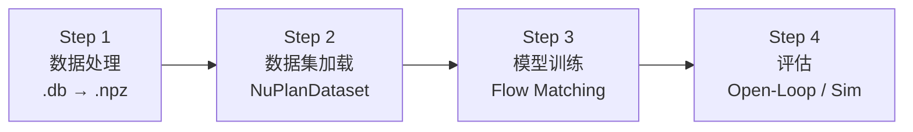
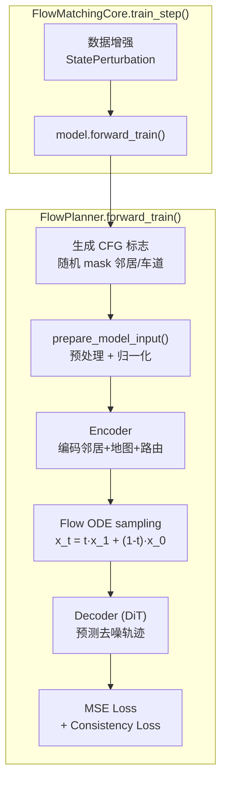
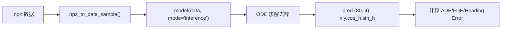

# Flow-Planner 完整训练流程详解

从原始 nuPlan 数据到最终评估的全流程，分 4 个阶段。



---

## Step 1: 数据处理 (.db → .npz)

**入口**: [data_process.py](file:///home/gcjms/Flow-Planner/data_process.py) → [DataProcessor.work()](file:///home/gcjms/Flow-Planner/flow_planner/data/data_process/data_processor.py#L208-L239)

### 1.1 场景加载

```python
# data_process.py
builder = NuPlanScenarioBuilder(data_path, map_path, ...)
scenarios = builder.get_scenarios(scenario_filter, worker)
```
从 nuPlan `.db` 文件中加载驾驶场景。每个场景包含 ego 车的状态历史、周围车辆、地图信息等。

### 1.2 对每个场景提取数据

`DataProcessor.work()` 对每个场景依次执行：

| 步骤 | 方法 | 输出 | 维度 |
|------|------|------|------|
| **Ego 过去轨迹** | `get_ego_agent()` | 21 帧 × 13 维 (x,y,heading,vx,vy,ax,ay,w,l,type,...) | `(21, 13)` |
| **邻居过去轨迹** | `get_neighbor_agents()` → `agent_past_process()` | Top-32 邻居 × 21 帧 × 11 维 | `(32, 21, 11)` |
| **静态物体** | 同上 | 5 个静态物体 × 10 维 | `(5, 10)` |
| **地图信息** | `get_map()` → `map_process()` | 车道线 70×20×12, 路由 25×20×12 等 | 多个数组 |
| **Ego 未来轨迹** | `get_ego_agent_future()` | 80 帧 × 3 维 (x, y, heading) | `(80, 3)` |
| **邻居未来轨迹** | `get_neighbor_agents_future()` | 32 × 80 × 3 | `(32, 80, 3)` |

### 1.3 坐标变换

> [!IMPORTANT]
> **所有数据都转换到"当前 ego 车坐标系"（ego-centric frame）**。

- **Ego**: `convert_absolute_to_relative_poses()` — 将全局坐标转为相对于当前 ego 位姿的局部坐标
- **邻居**: `convert_absolute_quantities_to_relative()` — 位置、速度都转到 ego 坐标系
- **地图**: `vector_set_coordinates_to_local_frame()` — 地图点坐标转到 ego 坐标系

### 1.4 额外状态计算

[calculate_additional_ego_states()](file:///home/gcjms/Flow-Planner/flow_planner/data/data_process/data_processor.py#L166-L206):
- heading → `(cos_h, sin_h)` 表示
- 计算 `steering_angle` 和 `yaw_rate`
- 生成 `ego_agent_past` (21, **14**维) 和 `ego_current_state` (**16**维)

`ego_current_state` 的 16 维含义：

| 索引 | 0 | 1 | 2 | 3 | 4 | 5 | 6 | 7 | 8 | 9 | 10 | 11 | 12 |
|------|---|---|---|---|---|---|---|---|---|---|----|----|-----|
| 含义 | x | y | cos_h | sin_h | vx | vy | ax | ay | steer | yaw_rate | width | length | type |

### 1.5 保存为 .npz

每个场景保存为一个 `.npz` 文件，包含以下 key：

```
ego_agent_past, ego_current_state, ego_agent_future,
neighbor_agents_past, neighbor_agents_future, static_objects,
lanes, lanes_speed_limit, lanes_has_speed_limit,
route_lanes, route_lanes_speed_limit, route_lanes_has_speed_limit
```

最后生成 `flow_planner_training.json` 索引文件。

---

## Step 2: 数据集加载与增强

### 2.1 Dataset

**文件**: [nuplan.py](file:///home/gcjms/Flow-Planner/flow_planner/data/dataset/nuplan.py#L193-L280)

`NuPlanDataset.__getitem__()` 从 `.npz` 加载数据，构成 `NuPlanDataSample` 数据类：

```python
NuPlanDataSample(
    ego_past,           # (21, 14)
    ego_current,        # (16,)
    ego_future,         # (80, 3)  ← GT label
    neighbor_past,      # (32, 21, 11)
    neighbor_future,    # (10, 80, 3)
    lanes,              # (70, 20, 12)
    routes,             # (25, 20, 12)
    map_objects,        # (5, 10)
    ...speedlimit 等
)
```

### 2.2 数据增强 (训练时)

**文件**: [state_aug.py](file:///home/gcjms/Flow-Planner/flow_planner/data/augmentation/state_aug.py#L62-L300)

`StatePerturbation` 在每个 batch 上执行：

1. **扰动当前状态**: 对 ego 的 `(x, y, heading, vel, acc, steer, ...)` 加均匀噪声
2. **重新生成未来轨迹**: 五次多项式插值 `refine_future_trajectory()` — 使扰动后的起点和 GT 终点平滑衔接
3. **重新中心化**: `centric_transform()` — 将所有数据（ego、邻居、地图）重新转换到**扰动后的 ego 坐标系**

> [!TIP]
> 数据增强是模拟 closed-loop 偏移的关键技巧。增大 `augment_prob` 可帮助模型适应 closed-loop 的误差累积。

---

## Step 3: 模型训练

### 3.1 训练入口

**文件**: [trainer.py](file:///home/gcjms/Flow-Planner/flow_planner/trainer.py)

用 Hydra 配置 + DDP 启动，核心循环：

```python
for epoch in range(epochs):
    for data in trainloader:
        data = data.to(device)
        loss = core.train_step(model, data)   # → FlowMatchingCore
        loss['total_loss'].backward()
        optimizer.step()
        ema.update(model)
    scheduler.step()
    save_model(...)
```

### 3.2 Flow Matching 训练流程



#### 3.2.1 CFG (Classifier-Free Guidance)

训练时随机 drop 邻居信息（概率 `cfg_prob`），推理时同时生成有条件和无条件预测，用 `cfg_weight` 混合。

#### 3.2.2 Encoder

[FlowPlannerEncoder](file:///home/gcjms/Flow-Planner/flow_planner/model/flow_planner_model/encoder.py#L5-L117):

```
输入: neighbors(32,21,11), static(5,10), lanes(70,20,12), routes(25,20,12)
  → 各自的 FusionEncoder 编码为固定维度 token
  → 拼接 + 位置编码
输出: encodings (agents_encoding, lanes_encoding), masks, routes_cond, token_dist
```

#### 3.2.3 Flow ODE

[FlowODE](file:///home/gcjms/Flow-Planner/flow_planner/model/flow_planner_model/flow_utils/flow_ode.py):

- **训练**: 采样时间 t，生成 `x_t = t·x_1 + (1-t)·x_0` (CondOT path)，模型预测 `x_1`
- **推理**: 从 `x_0 ~ N(0,1)` 出发，ODE 求解器积分到 `x_1` (去噪轨迹)

#### 3.2.4 Decoder (DiT)

[FlowPlannerDecoder](file:///home/gcjms/Flow-Planner/flow_planner/model/flow_planner_model/decoder.py#L10-L160):

```
输入: noised_trajectory_tokens, timestep t, encoder_outputs
  → 时间嵌入 + 路由条件 + action位置编码 + CFG嵌入
  → N 层 FlowPlannerDiTBlock (Joint Attention 多模态)
  → PostFusion (cross-attention)
  → FinalLayer → 预测轨迹
输出: (B, action_num, action_len, state_dim) 的轨迹 tokens
```

#### 3.2.5 损失函数

```python
total_loss = ego_planning_loss_weight * MSE(pred, target)
           + consistency_loss_weight * MSE(action_i_tail, action_{i+1}_head)
```
- `ego_planning_loss`: 预测轨迹 vs GT 的 MSE
- `consistency_loss`: 相邻 action token 重叠部分的一致性

#### 3.2.6 关键超参数

| 参数 | 默认值 | 说明 |
|------|--------|------|
| `epoch` | 400 | 训练轮数 |
| `batch_size` | 32 | 批大小 |
| `future_len` | 80 | 预测 8s (10Hz) |
| `action_len` | 8-16 | 每个 action token 的长度 |
| `state_dim` | 4 | 状态维度 (x, y, cos_h, sin_h) |
| `cfg_prob` | ~0.1 | CFG drop 概率 |
| `cfg_weight` | 1.8 | 推理时 CFG 权重 |
| `sample_steps` | ~10 | ODE 求解步数 |

---

## Step 4: 评估

### 4.1 Open-Loop 评估

**文件**: [eval_open_loop.py](file:///home/gcjms/Flow-Planner/eval_open_loop.py)



评估指标：

| 指标 | 含义 |
|------|------|
| **ADE** | 平均位移误差 (8s 全部帧) |
| **FDE** | 最终位移误差 (最后一帧) |
| **ADE@1s** | 前 10 帧平均误差 |
| **ADE@3s** | 前 30 帧平均误差 |
| **Heading Error** | 航向角误差 |
| **Lateral/Longitudinal** | 横向/纵向分量误差 |

### 4.2 Closed-Loop 仿真

通过 nuPlan 仿真器运行，使用 `observation_adapter()` 方法（与 `work()` 相同变换逻辑），每步：
1. 接收当前观测 → 转 ego 坐标系
2. 模型推理 → 预测轨迹
3. 执行第一个时间步 → 更新状态
4. 重复

---

## 一键运行脚本

[run_all.sh](file:///home/gcjms/Flow-Planner/run_all.sh) 封装了全部流程：

```bash
# 全流程运行
bash run_all.sh --epochs 200 --batch_size 32

# 跳过数据处理，只训练和评估
bash run_all.sh --skip_data_process --epochs 200

# 跳过数据处理和训练，只评估
bash run_all.sh --skip_data_process --skip_train
```

**流程**: 数据处理 → Train/Val 切分(80/20) → 训练 → Open-Loop 评估(Train + Val)
